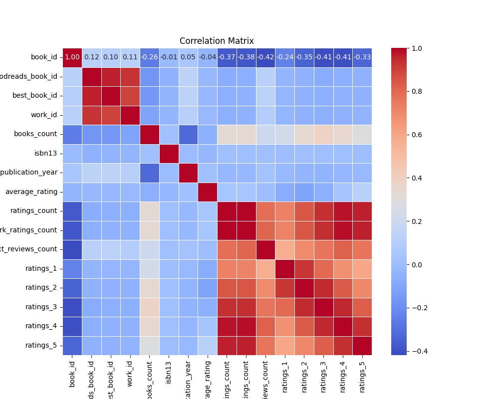

# Analysis Report

## Dataset Overview

        Dataset Summary:
        Total records: 10000
        Total fields: 24
        Column names: book_id, goodreads_book_id, best_book_id, work_id, books_count, isbn, isbn13, authors, original_publication_year, original_title, title, language_code, average_rating, ratings_count, work_ratings_count, work_text_reviews_count, ratings_1, ratings_2, ratings_3, ratings_4, ratings_5, image_url, small_image_url, Cluster_Group

        Missing Values:
        language_code                10.84
isbn                          7.00
isbn13                        5.85
original_title                5.85
original_publication_year     0.21
dtype: float64

        Correlation Details:
                                    book_id  goodreads_book_id  best_book_id   work_id  books_count  ...  ratings_1  ratings_2  ratings_3  ratings_4  ratings_5
book_id                    1.000000           0.115154      0.104516  0.113861    -0.263841  ...  -0.239401  -0.345764  -0.413279  -0.407079  -0.332486
goodreads_book_id          0.115154           1.000000      0.966620  0.929356    -0.164578  ...  -0.038375  -0.056571  -0.075634  -0.063310  -0.056145
best_book_id               0.104516           0.966620      1.000000  0.899258    -0.159240  ...  -0.033894  -0.049284  -0.067014  -0.054462  -0.049524
work_id                    0.113861           0.929356      0.899258  1.000000    -0.109436  ...  -0.034590  -0.051367  -0.066746  -0.054775  -0.046745
books_count               -0.263841          -0.164578     -0.159240 -0.109436     1.000000  ...   0.225763   0.334923   0.383699   0.349564   0.279559
isbn13                    -0.011291          -0.048246     -0.047253 -0.039320     0.017865  ...   0.006054   0.010345   0.012142   0.010161   0.006622
original_publication_year  0.049875           0.133790      0.131442  0.107972    -0.321753  ...  -0.019635  -0.038472  -0.042459  -0.025785  -0.015388
average_rating            -0.040880          -0.024848     -0.021187 -0.017555    -0.069888  ...  -0.077997  -0.115875  -0.065237   0.036108   0.115412
ratings_count             -0.373178          -0.073023     -0.069182 -0.062720     0.324235  ...   0.723144   0.845949   0.935193   0.978869   0.964046
work_ratings_count        -0.382656          -0.063760     -0.055835 -0.054712     0.333664  ...   0.718718   0.848581   0.941182   0.987764   0.966587
work_text_reviews_count   -0.419292           0.118845      0.125893  0.096985     0.198698  ...   0.572007   0.696880   0.762214   0.817826   0.764940
ratings_1                 -0.239401          -0.038375     -0.033894 -0.034590     0.225763  ...   1.000000   0.926140   0.795364   0.672986   0.597231
ratings_2                 -0.345764          -0.056571     -0.049284 -0.051367     0.334923  ...   0.926140   1.000000   0.949596   0.838298   0.705747
ratings_3                 -0.413279          -0.075634     -0.067014 -0.066746     0.383699  ...   0.795364   0.949596   1.000000   0.952998   0.825550
ratings_4                 -0.407079          -0.063310     -0.054462 -0.054775     0.349564  ...   0.672986   0.838298   0.952998   1.000000   0.933785
ratings_5                 -0.332486          -0.056145     -0.049524 -0.046745     0.279559  ...   0.597231   0.705747   0.825550   0.933785   1.000000

[16 rows x 16 columns]

        Outliers Found:
        {'book_id': 0, 'goodreads_book_id': 345, 'best_book_id': 357, 'work_id': 601, 'books_count': 844, 'isbn13': 556, 'original_publication_year': 1031, 'average_rating': 158, 'ratings_count': 1163, 'work_ratings_count': 1143, 'work_text_reviews_count': 1005, 'ratings_1': 1140, 'ratings_2': 1156, 'ratings_3': 1149, 'ratings_4': 1131, 'ratings_5': 1158}

        Cluster Analysis:
        Cluster_Group
0    9382
1     594
2      24
Name: count, dtype: int64
        

## Additional Insights
Based on the summary of the dataset, as well as the missing values, correlation details, outliers, and cluster analysis you've provided, here are some additional analysis steps and recommendations for insights that can be extracted from this dataset:

### 1. **Imputation of Missing Values**
   - **Assessment**: Analyze the impact of missing values on the dataset, especially for critical fields such as `language_code`, `isbn`, and `original_title`.
   - **Imputation Techniques**: Use statistical methods such as:
     - Mean/Median substitution for numerical fields.
     - Mode substitution for categorical fields.
     - Predictive modeling (e.g., KNN, regression models) can also be employed for imputed values.

### 2. **Exploratory Data Analysis (EDA)**
   - **Visualizations**: Create visualizations such as:
     - Histograms and boxplots for understanding the distribution of ratings (`average_rating`, `ratings_count`, etc.).
     - Bar charts for categorical distributions (e.g., authors, languages).
   - **Explore Cluster Characteristics**: Examine the profiles of each cluster in `Cluster_Group` to understand the key attributes of each segment (e.g., average ratings, ratings count).

### 3. **Outlier Treatment**
   - **Isolation**: Review outliers based on quantiles or standard deviations for critical fields, particularly for `average_rating` and `ratings_count`.
   - **Decision Making**: Decide to either remove outliers or transform them based on their relevance. Consider creating additional insights based solely on these outlier observations.

### 4. **Correlation Insights**
   - **Strength of Relationships**: Investigate the strongest correlations identified in the correlation matrix, focusing on:
     - `ratings_count` to each of the rating categories (1-5). Consider performing a regression analysis to predict outcome metrics based on these features.
   - **Multicollinearity Check**: Explore whether two or more factors are highly correlated and, if necessary, apply techniques like PCA (Principal Component Analysis) to reduce dimensionality.

### 5. **Comparative Analysis**
   - **Grouped Analysis**: Perform a grouped analysis based on `Cluster_Group` and examine how average ratings, ratings counts, and publication years differ across clusters.
   - **Temporal Analysis**: Analyze trends over time for `original_publication_year` and how they relate to `average_rating`.

### 6. **Text Analysis on Reviews**
   - If text data exists in the reviews, conduct **text mining** to derive sentiments or common themes using NLP techniques. This could involve:
     - Word clouds
     - Topic modeling (e.g., LDA)
     - Sentiment analysis methods

### 7. **Predictive Modelling**
   - **Rating Prediction Models**: Build regression models using features like `books_count`, `work_ratings_count`, and clusters to predict `average_rating` or `ratings_count`.
   - **Classification Models**: Explore classification techniques if there’s interest in predicting category membership related to `Cluster_Group`.

### 8. **Feature Engineering**
   - **Create New Features**: Propose to develop new features like:
     - Ratings average per author or book.
     - Popularity scores based on the `ratings_count` and `work_text_reviews_count`.
     - Yearly trends in `original_publication_year`.

### 9. **Validation and Robustness Checks**
   - Run cross-validation on predictive models established in the dataset to ensure the robustness of findings.
   - Use metrics such as RMSE and R-squared (for regressions) or accuracy and F1-score (for classifications).

### 10. **Reporting Insights**
   - **Dashboard Creation**: Summarize findings and visualizations into an interactive dashboard (using tools like Tableau, Power BI, or Python dashboards) for stakeholders.
   - **Document Key Findings**: Prepare a report that captures insights, recommendations, and any limitations discovered throughout the analysis process.

By following these steps, the analysis can provide a comprehensive understanding of the dataset and uncover valuable insights related to book ratings, authorship, and reader preferences.

## Plots

## Summary
**Title: The Lantern Makers**

In a village nestled between rolling hills and whispering meadows, there lived a quiet young woman named Elara. Charmingly reserved, she poured her heart into crafting beautiful lanterns that adorned every doorway and window of the village during the annual festival of lights. Each lantern was a token of her love, shaped delicately from her imagination and skill, shining brightly against the night sky. 

However, as the festival approached one year, Elara found her heart heavy with sorrow. Her beloved grandmother, who had taught her the art of lantern-making, had recently passed away. The old woman had been a guiding light in Elara's life, sharing stories filled with warmth and wisdom, illuminating the darkest corners of her soul. With her gone, Elara felt lost, as if the very inspiration she needed was snuffed out like a candle in a storm.

Despite her grief, Elara decided to honor her grandmother’s legacy. Every evening, she sat alone in her tiny workshop, weaving memories into each lantern. She carefully chose colors that reminded her of the vibrant tales her grandmother told, painting delicate motifs that reflected their shared love for the stars. But as days turned into weeks, Elara's energy waned; the joy she once felt in her craft was stifled beneath the weight of her sadness.

One chilly evening, while wandering through the village market in search of supplies, Elara noticed a group of children gathered around a stranger. Intrigued, she approached to find a juggler, a man dressed in colorful garments, entertaining the kids with tricks that set their laughter ringing through the air. Watching them, something inside her flickered. The image of her grandmother, a smile dancing on her lips, came rushing back. 

Inspired, Elara approached the juggler after his performance, introducing herself. The man, Haris, had an infectious spirit, a passion for delighting others, and he noticed the sadness hidden in Elara’s eyes. They began to chat, and for the first time since her grandmother's passing, Elara felt a connection rekindle. Haris shared stories of his own loss but highlighted how joy could coexist with grief. He encouraged her to allow the light of her grandmother’s memories to guide her instead of dimming her spirit.

Days turned into weeks, and with Haris’ encouragement, Elara began to share her lanterns’ stories. She set up a small booth at the market, each lantern accompanied by a tale of love and legacy, glimmering like the stars her grandmother adored. The villagers were enchanted, coming together to listen, laugh, and feel the warmth of her memories come alive.

As the festival drew near, Elara decided to create a grand lantern, one that would symbolize not only her love for her grandmother but also the strength she had found through sharing her heart. With newfound enthusiasm, she worked tirelessly, crafting a stunning piece adorned with colorful glass that mirrored the night sky. 

Finally, the night of the festival arrived. Filled with anticipation, Elara lit her grand lantern. The flames danced fiercely within, sending brilliant shimmers into the dark. When the lantern was unveiled, gasps echoed through the crowd, and a soft hush fell over the villagers. Then, Haris stepped forward and invited everyone to join in stitching their lights together, creating a woven tapestry of illumination across the village.

As they all connected their lanterns, Elara found herself encircled by laughter, stories, and shared warmth. She realized that through their collective light, the sorrow of loss transformed into a celebration of love. In that moment, she understood: her grandmother’s essence would forever flicker in every lantern she made, brightening even the darkest nights.

The festival went on, an enchanting spectacle of lights shining against the backdrop of the starry sky. Elara felt lighter, her heart filled with hope and connection. With every fluttering flame that danced around her, she was reminded—grief could give way to joy if she embraced the journey with an open heart. 

From then on, Elara not only crafted lanterns that illuminated her village but also nurtured the sprouting tomorrows of her dreams, forever guided by the shining legacy of love that was her grandmother. And as the villagers watched the twilight glow gently fade into dawn, they knew they had all shared in a moment of magic, a reminder that from loss often blooms the brightest light.