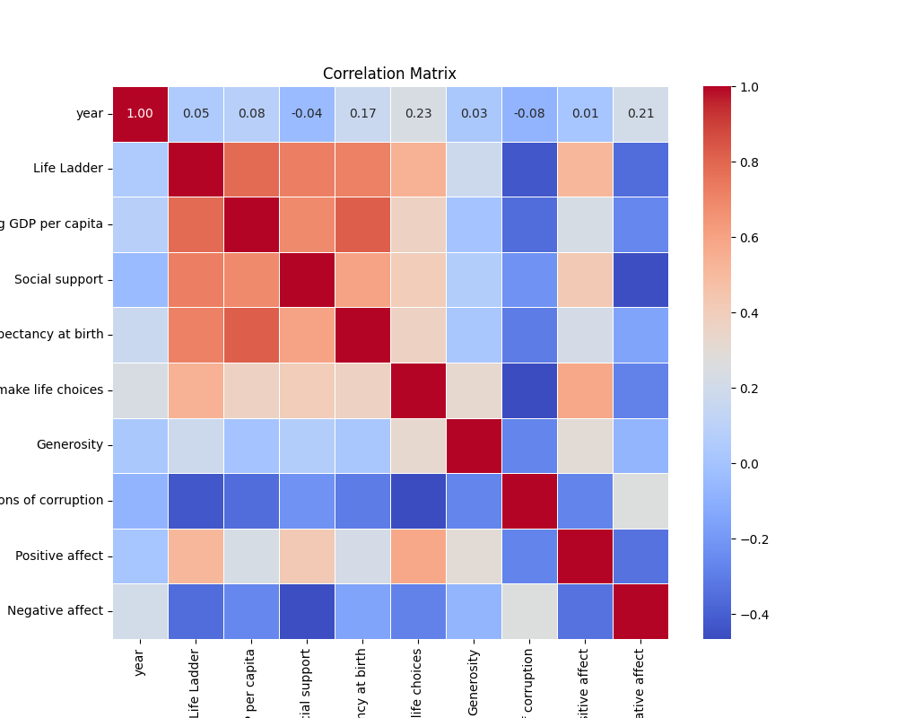

# Analysis Report

## Dataset Overview

        Dataset Summary:
        Total records: 2363
        Total fields: 12
        Column names: Country name, year, Life Ladder, Log GDP per capita, Social support, Healthy life expectancy at birth, Freedom to make life choices, Generosity, Perceptions of corruption, Positive affect, Negative affect, Cluster_Group

        Missing Values:
        Perceptions of corruption           5.289886
Generosity                          3.427846
Healthy life expectancy at birth    2.666102
Freedom to make life choices        1.523487
Log GDP per capita                  1.184934
Positive affect                     1.015658
Negative affect                     0.677105
Social support                      0.550148
dtype: float64

        Correlation Details:
                                              year  Life Ladder  Log GDP per capita  ...  Perceptions of corruption  Positive affect  Negative affect
year                              1.000000     0.046846            0.080104  ...                  -0.082136         0.013052         0.207642
Life Ladder                       0.046846     1.000000            0.783556  ...                  -0.430485         0.515283        -0.352412
Log GDP per capita                0.080104     0.783556            1.000000  ...                  -0.353893         0.230868        -0.260689
Social support                   -0.043074     0.722738            0.685329  ...                  -0.221410         0.424524        -0.454878
Healthy life expectancy at birth  0.168026     0.714927            0.819326  ...                  -0.303130         0.217982        -0.150330
Freedom to make life choices      0.232974     0.538210            0.364816  ...                  -0.466023         0.578398        -0.278959
Generosity                        0.030864     0.177398           -0.000766  ...                  -0.270004         0.300608        -0.071975
Perceptions of corruption        -0.082136    -0.430485           -0.353893  ...                   1.000000        -0.274208         0.265555
Positive affect                   0.013052     0.515283            0.230868  ...                  -0.274208         1.000000        -0.334451
Negative affect                   0.207642    -0.352412           -0.260689  ...                   0.265555        -0.334451         1.000000

[10 rows x 10 columns]

        Outliers Found:
        {'year': 0, 'Life Ladder': 2, 'Log GDP per capita': 1, 'Social support': 48, 'Healthy life expectancy at birth': 20, 'Freedom to make life choices': 16, 'Generosity': 39, 'Perceptions of corruption': 194, 'Positive affect': 9, 'Negative affect': 31}

        Cluster Analysis:
        Cluster_Group
0    1558
1     739
2      66
Name: count, dtype: int64
        

## Additional Insights
Based on the current insights derived from the dataset, here are several additional analysis steps that can be taken to gain deeper insights and address potential research questions:

### 1. **Imputation of Missing Values:**
   - Investigate methods for handling the missing values. You could consider:
     - **Imputation**: Using mean, median, or mode for numerical fields or common values for categorical ones.
     - **Predictive Imputation**: Applying machine learning techniques to predict and fill in missing values based on other available data.
   - Analyze the distributions of the fields with missing values before and after imputation to assess impact.

### 2. **Exploratory Data Analysis (EDA):**
   - **Visualizations**: Create plots (box plots, scatter plots, pair plots) to visually inspect the relationships between key variables and to better understand outliers.
   - **Distribution Analysis**: Analyze the distribution of each metric (e.g., Life Ladder, Log GDP per capita) to identify skewness or unusual characteristics.

### 3. **Deeper Correlation Analysis:**
   - Consider conducting a **multicollinearity analysis** among highly correlated variables (e.g., Life Ladder, Log GDP per capita) to see if some can be combined or removed.
   - Use **partial correlation analysis** to evaluate the relationship between pairs of variables while controlling for the influence of other variables.

### 4. **Investigating Clusters:**
   - Perform a **profile analysis** of each cluster by aggregating means and medians for the significant indicators. This can highlight distinct characteristics or patterns within each cluster group.
   - Visualize the clusters using techniques like PCA (Principal Component Analysis) to reduce dimensionality and plot the clusters based on their characteristics.

### 5. **Temporal Analysis:**
   - Investigate the temporal trends of key metrics (e.g., Life Ladder over the years) across different countries or clusters to identify changes and patterns over time.
   - Analyze seasonality or other cyclic patterns in the dataset if applicable.

### 6. **Hypothesis Testing:**
   - Conduct statistical tests to evaluate specific hypotheses, e.g., whether regions (or cluster groups) significantly differ in terms of average Life Ladder scores or GDP per capita.
   
### 7. **Relationship Analysis:**
   - Utilize **regression analysis** (linear or logistic depending on the response variable) to identify predictors of Life Ladder scores or other dependent variables. 
   - Explore interaction effects between two or more independent variables on dependent variables.

### 8. **Outlier Handling:**
   - Investigate the outliers identified in the dataset to understand their causes. This may involve qualitative analysis or further context-driven exploration.
   - Decide on appropriate methods for handling these outliers (e.g., removal, transformation) to avoid skewed analysis results.

### 9. **Impact of Corruption:**
   - Conduct a specific analysis focusing on how perceptions of corruption (highly negatively correlated with Life Ladder) impact quality of life indicators.
   - Use methods like **regression analysis** to explore the causal relationship.

### 10. **Generate Actionable Insights:**
   - Summarize findings with actionable insights to inform policy recommendations or strategic decisions. This may include development programs for countries showing low Life Ladder scores despite high GDP.

### 11. **Report Findings & Visualizations:**
   - Summarize findings in a comprehensive report with visualizations that convey insights clearly.
   - Make recommendations for future research or data collection based on identified gaps or limitations in the current dataset.

By addressing these additional analysis steps, you can deepen your insights into the relationships among the variables in the dataset, ultimately leading to a better understanding of the factors influencing quality of life across different countries.

## Plots

## Summary
**Title: The Heart of Redemption**

In a small town where the sun kissed the horizon gently, lived a woman named Clara. Once a vibrant dreamer with laughter echoing like sweet music through her home, she now found herself cloaked in shadows. The loss of her only son, Jason, had emptied her heart and sown seeds of despair in her soul. Each day slipped through her fingers like sand as she struggled to find purpose amid the echoes of his absence.

Clara had always been known for her acts of kindness, a pillar of hope in her community. But following the tragedy, her light dimmed. The laughter of children that once brought her joy became a reminder of what she had lost. The town noticed her transformation, but fear of intruding on her grief kept neighbors at bay. 

Days turned into weeks, then months, and before she knew it, Clara spent nearly all her time in solitude, drowning in the weight of her sorrow. In her heart, she yearned for connection but felt unworthy of it. Her only solace came from a tattered journal where she poured her feelings, capturing the bittersweet memories of her son—his laughter, his dreams, his infectious joy. 

One evening, as she wandered down the lane where Jason used to play, Clara noticed an old woman struggling with the groceries. Memories flooded back—her son’s unwavering willingness to help anyone in need. Without thinking, she stepped forward. The old woman, surprised, thanked her profusely, her eyes glistening with warmth. Clara smiled—a small, fragile smile that hadn’t touched her lips in what felt like a lifetime.

In that fleeting moment, something shifted within her. Kindness awakened a long-forgotten spark—a reminder of the love she had shared. That night, instead of dwelling in sorrow, Clara re-read her journal, piecing together moments of joy that mingled with her grief. She found a soft glimmer of hope tucked within the pages of her memories.

The following day, encouraged by that small act of kindness, Clara embarked on a new journey—a mission to revive her community spirit. She organized a charity bake sale to help local families in need, pouring her heart into every pie and cookie. The townsfolk, knowing her heart always extended to others, rallied around her, guiding her steps toward healing. The laughter of children returned like a warm embrace, reminding Clara of Jason’s spirit.

As the day of the bake sale approached, Clara faced her fears of being vulnerable. Standing before a crowd, she shared her story with tears tracing paths down her cheeks, mingling sorrow with strength. "We each bear our burdens," she said, voice trembling but resolute. "But together, we can find the light again." 

The air was electric; her words resonated, drawing people from every corner of the town. Strangers embraced her, inspired by her journey of redemption. It was in this shared vulnerability that Clara discovered the transformative power of connection. 

Months passed, and the charity grew. The town became a tapestry of community, woven together with each act of generosity, each shared meal, a revival of the love Clara had always fostered. With every new face and every new friendship, she felt Jason’s presence in their laughter, in the lives she touched.

One day, as she walked the familiar lane, she spotted a group of children playing tag, their laughter ringing out like a bell—a sound so pure it made her heart swell. They spotted her and paused, beaming with joy, inviting her to join. Clara hesitated, her heart racing, before she accepted their invitation, stepping into the light she'd long hidden from.

In that moment of play, she felt his spirit intertwining with hers, an affirmation that love never really disappears; it transforms and enriches our lives in unexpected ways. Clara's heart brimmed with warmth, filled once again with purpose and connection.

The town thrived, a testament to the healing power of love and community. Clara had transformed her grief into strength, and through vulnerability had discovered redemption—not just for herself, but for everyone around her. 

Driven by hope, Clara learned that while loss is profound, love is eternal. Each act of kindness she extended became a tribute to Jason, a celebration of life that echoed through the laughter of children on sun-drenched days and the vibrant connections that filled her heart anew. Clara smiled, for in her journey, she had not just reclaimed her identity but rediscovered the beauty of living fully—one heartwarming moment at a time.