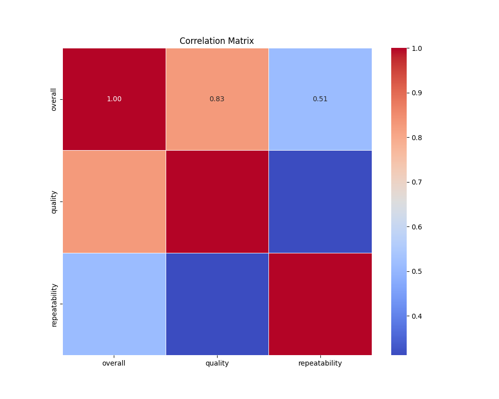

# Analysis Report

## Dataset Overview

        Dataset Summary:
        Total records: 2652
        Total fields: 9
        Column names: date, language, type, title, by, overall, quality, repeatability, Cluster_Group

        Missing Values:
        by      9.879336
date    3.733032
dtype: float64

        Correlation Details:
                        overall   quality  repeatability
overall        1.000000  0.825935       0.512600
quality        0.825935  1.000000       0.312127
repeatability  0.512600  0.312127       1.000000

        Outliers Found:
        {'overall': 1216, 'quality': 24, 'repeatability': 0}

        Cluster Analysis:
        Cluster_Group
1    1158
2     919
0     575
Name: count, dtype: int64
        

## Additional Insights
Based on the provided dataset summary and insights, here are some proposed additional analysis steps you could consider to derive further insights:

### 1. **Exploratory Data Analysis (EDA)**
   - **Visualize Missing Values:** Create a heat map to visualize missing values across fields. This can help to identify patterns in missing values. Are certain languages or types missing more data?
   - **Distribution Analysis:** Examine the distribution of `overall`, `quality`, and `repeatability` scores. Use histograms, box plots, and kernel density plots to better understand their distribution and detect potential anomalies.
   - **Language and Type Analysis:** Analyze the `language` and `type` fields to see how they relate to `overall`, `quality`, and `repeatability`. Are certain languages or types consistently higher or lower in specific metrics?

### 2. **Missing Value Treatment**
   - **Imputation Strategies:** Consider appropriate imputation methods for the missing values in the `by` and `date` fields. Options include using the mean, median, mode for numerical values, or adding a category for missing entries in categorical fields.
   - **Impact of Missing Data:** Analyze how the missing values impact the overall dataset and proceed with the imputation to see if correlations hold after filling the missing values.

### 3. **Further Correlation and Performance Analysis**
   - **Detailed Correlation Exploration:** Analyze partial correlations or run multivariate regression analysis to understand the relationships between `overall`, `quality`, and `repeatability` while controlling for other variables.
   - **Performance by Cluster Group:** Evaluate how each `Cluster_Group` performs across `overall`, `quality`, and `repeatability`. Use boxplots to visualize differences between these clusters.

### 4. **Outlier Investigation**
   - **Outlier Impact:** Investigate the reasons behind the outliers in the `overall` field. Try to understand if these outliers are valid points or data entry errors.
   - **Effect of Outliers:** Perform a sensitivity analysis to assess how removing outliers in `overall` affects the data metrics and clustering results.

### 5. **Clustering Analysis**
   - **Cluster Characteristics:** Investigate common characteristics of each cluster group based on the other fields (e.g., language distribution, types, performance metrics).
   - **Cluster Validation:** Utilize clustering validation metrics (e.g., silhouette score, Davies-Bouldin index) to evaluate the effectiveness of the clustering and consider different clustering algorithms (e.g., K-means, hierarchical clustering).

### 6. **Temporal Analysis**
   - **Date-based Trends:** Analyze how metrics vary over time. Is there a trend in the `overall`, `quality`, or `repeatability` scores as time progresses? Visualize this with time series plots.
   - **Seasonality:** Investigate if there are seasonal effects that impact the metrics within the `date` field.

### 7. **Predictive Modeling**
   - **Model Development:** Depending on the insights, develop predictive models to forecast `overall`, `quality`, or `repeatability` scores based on input features. Regression analyses or machine learning models could be utilized.
   - **Feature Importance:** Once a model is trained, analyze the importance of different features and their impact on predicted values.

### 8. **Sentiment Analysis (if applicable)**
   - **Text Analysis:** If the dataset contains qualitative assessments in the `title` or `by` fields, consider performing sentiment analysis to see how sentiment correlates with quantitative metrics.

### 9. **Comparison with External Benchmarks**
   - **Industry Comparison:** If available, compare the metrics against industry standards or benchmarks to see how the dataset stands relative to broader trends.

By implementing these steps, you would gain a deeper understanding of the dataset, identify key factors influencing the metrics of interest, and derive actionable insights to inform future decisions or research.

## Plots

## Summary
**Title: The Weight of Love**

In the small town of Willow Creek, nestled between rolling hills and lush forests, lived an elderly woman named Agnes. A retired schoolteacher, she was known for her love of books and the joy she found in nurturing young minds. But behind her warm smile lay a heart that carried the heavy burden of loss. Her husband, Harold, had passed away a decade earlier, and although time had dulled the edges of her grief, the empty chair at the dining table always served as a painful reminder of his absence.

Agnes spent her days tending to her garden, where vibrant flowers bloomed generously, their colors a stark contrast to the grayness that life had sometimes cast over her spirit. Each blossom was a testament to her resilience, yet every morning, as she poured her coffee and sat in silence, she felt the profound loneliness seep into her bones.

One sunny afternoon, as Agnes watered her petunias, a soft whimper caught her attention. Following the sound, she found a small, trembling puppy, lost and scared, hiding behind her garden shed. It was a scruffy little thing with matted fur and wide, soulful eyes. Without thinking, Agnes knelt down, extending her hand gently. The puppy sniffed her palm before cautiously inching closer. 

“I won’t hurt you, my little friend,” she whispered, her voice soothing. “Let’s get you cleaned up.”

Agnes named the puppy Max, and in the days that followed, the two became inseparable. As Max bounded through the garden, his energy rekindled a flicker of joy in Agnes's heart that she thought had long extinguished. She found herself laughing again, feeling a warmth spread within her that she had almost forgotten. On days when the memories of Harold felt too heavy, the puppy’s playful antics provided solace.

Yet, as winter approached, the cold winds and snowfall began to remind Agnes of the severing cold she felt when Harold had passed. With the warmth of her little companion, however, any gloom slowly faded. 

Life took a beautiful turn one crisp, snowy afternoon. Agnes decided to take Max for a walk through the town, something she hadn’t done in years. As they came upon the town square, she noticed a gathering. People clustered around, their faces lit by the laughter of children, the spirit of the holiday season alive in the air.

Feeling a familiar pang of loneliness, she hesitated but Max tugged at the leash, leading her into the throng. Suddenly, a small voice squealed, “Look, Mom! That doggie is so cute!” A little girl, no older than seven, rushed towards them, her eyes sparkling with delight. 

“Can I pet him?” she asked eagerly, her face glowing with excitement.

Agnes, her heart warming, nodded. The little girl knelt down and Max, ever the charmer, danced around her, showering her with playful puppy kisses. Agnes felt the walls she had built around herself start to crumble, piece by piece, as other children, and eventually their parents, began to gather, drawn in by Max's infectious spirit.

“His name is Max,” Agnes found herself saying, a smile breaking free.

As stories were shared, laughter rang through the air, and Agnes realized how joyous it felt to connect with others again. She had been so consumed by her grief that she had withdrawn into solitude, but now, standing in the midst of strangers who shared a moment of joy, she felt the warmth of a community she had long neglected.

Weeks turned into months, and Agnes began to host gatherings at her home. Children and their families would come over to frolic with Max in the garden. Laughter replaced the silence, while conversations filled the air. Slowly, the burden of her loneliness lifted, revealing the beauty of community and connection that had always been waiting just beyond her door.

By the time spring arrived, Agnes not only had a loving puppy but a community that embraced her, a tapestry of stories and laughter woven around her life. On a warm sun-drenched afternoon, with the flowers blooming vibrantly against a crystal-blue sky, Agnes stood in her garden, heart full as she watched children play.

In Max, she had found a second chance at love, and through that little puppy, she had discovered redemption—a path back to the world, to joy, and to the love that was still very much alive in her heart. With each passing day, she blossomed anew, ready to share her love, her stories, and her laughter with the life around her.

And so, in the town of Willow Creek, the story of Agnes and Max became a beacon of hope, a gentle reminder that love, in its many forms, has the power to heal, transform, and uplift even the heaviest of hearts.